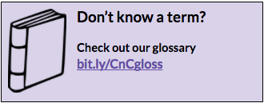

# Coding & Cocktails Session 3:
## Command Line Basics {#command-line-basics}

****

### Overview

During the session we’ll cover Command Line basics. We’ll put those to use here getting comfortable with interacting with the filesystem in a text based way!

