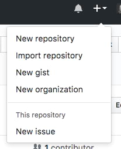

1. In Chrome, navigate to GitHub and create a new repository by clicking the <span class="octicon octicon-plus"></span> button in the upper right corner. Select **New repository**.
   
   

1. Name your repository "MyFirstRepo". Add a short description and check the **Initialize this repository with a README** checkbox. Click **Create repository**.

   

    
You can ignore the **Add .gitignore** and **Add a license** dropdowns for the time being.  You won't need them for what we are doing this evening.
    

1. You now have a repository! Notice you're automatically on 'master' branch. Click the green **Clone or download** button and copy the link by clicking on the <span class="octicon octicon-clippy"></span> button.

1. In your terminal, navigate to the "CodingAndCocktails/session3" folder. Type `git clone` and paste the link to your repository that you copied in the previous step. Press `Enter`. Your terminal will look like this
   ```
**[terminal]
**[prompt LadyDev@Coding&Cocktails]**[path  ~/CodingAndCocktails/session3]
**[delimiter λ ]**[command git clone https://github.com/kcwit/MyFirstRepo.git]
Cloning into 'MyFirstRepo'...
remote: Enumerating objects: 3, done.
remote: Counting objects: 100% (3/3), done.
remote: Total 3 (delta 0), reused 0 (delta 0), pack-reused 0
Unpacking objects: 100% (3/3), done.
   ```

1. List out the folders in "session3" directory. You should see a new folder named "MyFirstRepo". Navigate into "MyFirstRepo" and notice your terminal now contains the name of the branch 'master'.
   
Don't forget to use Tab completion to make typing in the terminal easier!
   

   
If you are borrowing a laptop, you need to set your username and email for git. 
In your terminal, double check that you are in the "MyFirstRepo" directory and type the following 2 commands (notice the quotes for name). Press `Enter` between each command.
```sh
git config user.name "Your Name"
git config user.email your@email.com
```

Feel free to grab a mentor for help!
   

1. List all the files, including the hidden ones, to see the files Git creates for you. You should see the following files
   ```
**[terminal]
**[prompt LadyDev@Coding&Cocktails]**[path  ~/CodingAndCocktails/session3/MyFirstRepo (master)]
**[delimiter λ ]**[command ls -al]
./
../
.git/
README.md
   ```

   
Git has special files. One of them is the ".git" folder. It contains all the information on reconstructing the version history for your repository. The ".git" folder is a profile file we discussed earlier in the command line section.  
   

  
If you don't see the ".git" folder in the file explorer, you will need to enable viewing hidden files. 
  

1. Type `git status` <i class="fa fa-share fa-rotate-180"></i>. You will see something like this
   ```
**[terminal]
**[prompt LadyDev@Coding&Cocktails]**[path  ~/CodingAndCocktails/session3/MyFirstRepo (master)]
**[delimiter λ ]**[command git status]
On branch master
Your branch is up to date with 'origin/master'.
nothing to commit, working tree clean
   ```
   
We haven't done anything to the repository so our working tree is clean. We can always run `git status` to double check our work.     
   

1. Let's open the repository in GitKraken. In GitKraken, select **File** <i class="fa fa-long-arrow-right"></i> **Open Repo**. In the **Repository Management** dialog select **Open a Repository** and select your "MyFirstRepo" folder in your "CodingAndCocktails/session3" directory.

1. When you create a repository with a README file, GitHub automatically commits the file for you. You have 1 commit in your repository! Feel free to inspect your commit, the file, and your branch.

1. Before starting any work in a git repository, it's good practice to make sure you have the latest changes. In the terminal, type `git pull` <i class="fa fa-share fa-rotate-180"></i>. Your terminal should state it's up to date.

