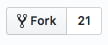

# Create a Pull Request and merge your code

Let's create pull request to merge our work into 'master'.


##### Hey Slacker!

Remember, we're here to help.
Join the KCWiT #codingandcocktails Slack Channel: [kcwit.slack.com](http://kcwit.slack.com)


1. In Chrome, navigate to your "MyFirstRepo" page. Click on the button next to your selected branch labeled **New pull request**. 

1. Under **Compare changes**, use the right dropdown menu to select 'cocktails-branch'.
   

1. Your view will switch to **Open a pull request**. Scroll down to the bottom of the page to see a diff of changes. Press the green **Create pull request** button.

1. Click the green **Squash and merge pull request** button and **Confirm merge** button to merge your changes.

1. Click the ** Code** tab at the top of the page to navigate back to your code. Click on _cocktails.txt_ to see your changes from 'cocktails-branch' in 'master'.

1. Open your terminal and navigate to your "MyFirstRepo" folder in "CodingAndCocktails/session3" folder.

1. Pull down the latest changes by typing `git pull` <i class="fa fa-share fa-rotate-180"></i>.

1. Change branches to 'master' by typing `git checkout master` <i class="fa fa-share fa-rotate-180"></i>.

# Fork a buddy's repo

1. Find a Coding & Cocktails buddy's GitHub repo. Reach out on Slack if you need to. Using Chrome, navigate to their "MyFirstRepo" page.

1. Find the ** Fork** button in the upper right corner of the page and click on it.

    

    
If asked, “Where should we fork this repository?” Select your personal profile. This question indicates you're a part of a GitHub organization but we want to use our personal accounts this evening.  If you are not asked that question, carry on.
    

1. In your terminal, navigate to "CodingAndCocktails/VersionControl" folder in your home directory. If you are already in "MyFirstRepo", you can type `cd ..` <i class="fa fa-share fa-rotate-180"></i>.

1. GitHub will automatically add a "-1" to the name of the repository so that repository names are unique. Once the fork completes, GitHub navigates to your fork. Click on the green clone button to get the link to clone the fork to your machine.
   

Need a little help? Expand this section for guidance. 

Type <code>git clone </code> and paste the link <i class="fa fa-share fa-rotate-180"></i>.

   

1. Navigate into "MyFirstRepo-1" and create a new branch using your username and add "-branch" after it. In our example, user "ladydev" will create "ladydev-branch".
   

Need a little help? Expand this section for guidance. 

Type <code>git checkout -b ladydev-branch</code> <i class="fa fa-share fa-rotate-180"></i>.

   

1. In the newly created branch, create a new file named using your name, such as "ladydev.txt". Add the message "Hello fellow ladydev!". Feel free to use the `echo` command, `vim`, or in Atom.

1. In the terminal, add, stage, and commit your file. Add a friendly commit message.
   

Need a little help? Expand this section for guidance. 

Type <code>git add ladydev.txt</code> <i class="fa fa-share fa-rotate-180"></i>. 
Type <code>git commit -m "friendly commit message here"</code> <i class="fa fa-share fa-rotate-180"></i>.

   

1. Push your changes and branch.
   

Need a little help? Expand this section for guidance. 

Type <code>git push --set-upstream origin branch-name</code> <i class="fa fa-share fa-rotate-180"></i>.

   

1. Create a pull request by clicking the **New pull request** button. 

1. This time when comparing branches you're comparing against forks. We want the changes from our branch to migrate to your buddy's master branch so select your newly created branch in the right-most dropdown. 

1. Click the green **Create pull request** button twice. You created a pull request to make a change to your buddy's repo! Hopefully they merge it in soon!

1. Don't forget to accept your buddy's pull request
   1. To merge in your buddy's pull request, navigate to your "MyFirstRepo" in Chrome. Click on ** Pull requests** to see the pull request. There should be a number after it indicating the number of open pull requests.

   1. Click on a pull request. Click the green **Merge pull request** button and then click the green **Confirm merge** button.

