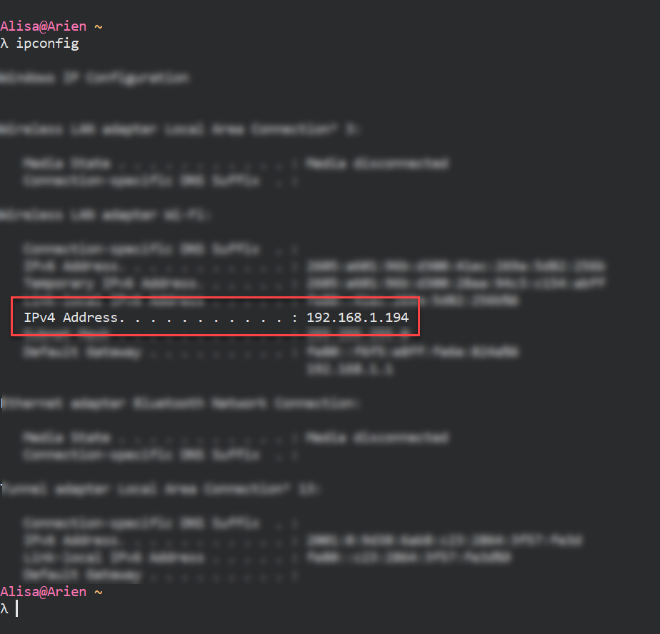
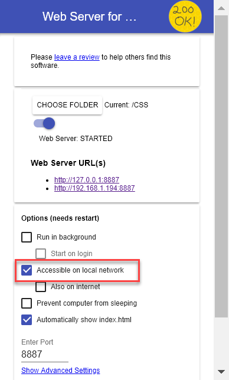

# Bonus - Running a server
We can serve up web content on our own machine, but sometimes we want to make the content available publicly. In this bonus assignment we'll learn a little bit about networking by using a Chrome extension to act as a web server and use [ngrok](https://ngrok.com/), a command line service to expose your web server to the public securely using a HTTP tunnel.

## Prerequisites
For this assignment, find a Slack buddy so you can share content to each other!

You should also have something to share. You can share your work from the first or second session. If you don't have something to share, create a "CSS" directory in your `~/CodingAndCocktails` directory, and save the contents of CSS session answer key [from this zip file](https://github.com/KansasCityWomeninTechnology/CSSCompilerPractice/archive/2018-checkpoint-bonus-media-query.zip).


##### Hey Slacker!

Remember, we're here to help.
Join the KCWiT #codingandcocktails Slack Channel: [kcwit.slack.com](http://kcwit.slack.com)


## Install and set up a web server

1. Using Chrome, install the Chrome Extension [Web Server for Chrome](https://chrome.google.com/webstore/detail/web-server-for-chrome/ofhbbkphhbklhfoeikjpcbhemlocgigb) by clicking on the link. Click the **ADD TO CHROME** button and click **Add app** on the dialog that opens. It installs as a desktop application so you can run it the same way you run any of your applications or from Chrome itself.
  
   

1. Launch "Web Server for Chrome" application. 

1. Click **CHOOSE FOLDER** and navigate your `~/CodingAndCocktails/CSS` or to a directory of your choosing with web content to share.
   
   

1. Notice the **Web Server URL(s)** has a link that looks something like `http://127.0.0.1:8887`. The numbers after the colon is the port. In this case, we are serving content to our local machine using port 8887 but Chrome Web Server may use a different port for you. The network address `127.0.0.1` means home and is also referred as `localhost`. You can change the port if you want to but some ports are pre-allocated and may cause conflicts. 
   
   

1. Click on the URL link or type in the URL manually in Chrome. You should see your content.
  
   

1. Try opening a new browser pointed to `localhost`. Don't forget to add your port! You should see your content.

1. Each computer connected to a network has an **I**nternet **P**rotocol address, commonly referred to as **IP** address. Let's identify our IP address. In your terminal, run the command for your OS:
     
ifconfig
    
ipconfig
   

   Your IP address is either listed as `inet addr` on Mac or `IPv4 Address` on Windows in the output. Don't worry, with proper firewall protection, your machine is safe.
   
   

1. Web Server for Chrome can serve content to this address as well. Slide the toggle under **CHOOSE FOLDER** to stop the web server.

1. Enable **Accessible on local network** and start the web server. You now see a new URL show up. It should be your IP address.

   

1. Open a browser tab to the URL. You should see your content. 🎉  

You're running a local web server! Now we want to use our command line skills and make our content securely available publicly using [ngrok](https://ngrok.com/).

## Create a public tunnel

1. Create an account on [ngrok](https://ngrok.com/) and follow the installation steps. Remember where you installed ngrok.

1. Open a terminal and navigate to the directory where you installed ngrok.
   
Windows users - open the standard cmd shell in Cmder.


1. Run ngrok using the command for your OS. You will need to use the port you used when serving content. 
  
    
   ./ngrok http 8887
    
   ngrok http 8887
   

   Your command line will display the public URL of your content.
  
   

1. Navigate to either Forwarding URL in your phone. You can see your content! Share your URL with your Slack buddy or on the #codingandcocktails Slack channel. 
   
   You created a HTTP tunnel! A tunnel is a network link. In our case we created a tunnel from your computer to the public using the HTTP protocol. HTTP stands for **H**yper**t**ext **T**ransfer **P**rotocol and is what the internet is based on. You will learn more about protocols and the different types of protocols in the homework.


1. To exit out of ngrok, hit `CTRL+C`. When you exit out of ngrok, your public content will no longer be available.