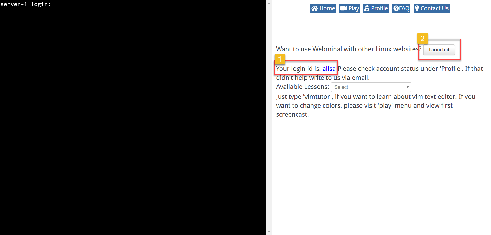

Tonight we will use [Webmnial](http://www.webminal.org) as your terminal. You will be using a Linux operating system.

1. Sign up for a [free account at Webminal](http://www.webminal.org/register/).

1. Confirm your account from your email and log in to Webminal.

1. Select **Terminal** from the top toolbar. A new browser tab will open.

1. Note your login id. This is what you will use to log in. Click **Launch it** button as highlighted in the picture below.
   

1. In the separate window that opened when you clicked **Launch it**, enter your login id and the password you used when you signed up.
   
You will automatically get logged out of the terminal if you have a period of inactivity. You may have to retrace a few steps to get back to your worksheet location.   
   
