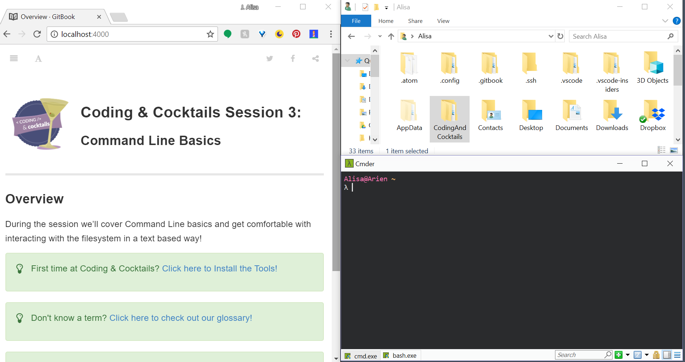


The <i class="fa fa-share fa-rotate-180"></i> icon tells you when to press `Enter`.


1. In your terminal, type `pwd` <i class="fa fa-share fa-rotate-180"></i> in your CLI to see your current directory. `pwd` stands for **p**rint **w**orking **d**irectory. 
   
You should be in your home directory. You will see `~` after your prompt. We will refer to this directory as your home directory in the remainder of the worksheet.
    

1. Open a file explorer by using the following command for your operating system (click on the tab for your operating system)
     
    open .
     
    start .
    

    
View the worksheet, terminal, and file explorer all at the same time by adjusting application layout. 

We want to lay out our workspace to look like this.

For Windows users, use `windows key` + `left arrow` or `windows` + `right arrow` to resize the application and position to the left or right half of your screen.

For Mac users, hold down the full-screen button in the upper-left corner of a window to shrink and position to the left or right side of the screen. Release the button, then click another window to begin using both windows side by side.

Chromebook users, sorry, you won't be able to open a file explorer. You'll use the command lines operations to inspect your work tonight.

Mentors are happy to help!
   
   
Did you know you can collapse the table of contents for worksheets?

Click on the hamburger menu (<i class="fa fa-bars" aria-hidden="true"></i>) at the top of the page to toggle the table of contents. You can also use keyboard shortcut `s`- click anywhere on the worksheet to give the browser tab focus and press `s`.
   
      
Did you know you can customize font size and color of the worksheets to make it easier for you to see?

Click on the font menu (<i class="fa fa-font" aria-hidden="true"></i>) at the top of the page to open a menu where you can make your font larger or smaller or change background color.
   

1. In the terminal, type `ls` <i class="fa fa-share fa-rotate-180"></i> to see the contents of your current directory. You should see the same files in the terminal as you see in the explorer.

1. Next, **c**hange **d**irectory into the "CodingAndCocktails" directory listed in the output of `ls` by typing `cd CodingAndCocktails` <i class="fa fa-share fa-rotate-180"></i>.
   
If you don't have a "CodingAndCocktails" directory, take a moment to [set up your workspace](/setup).
    
   
Both Cmder and oh-my-zsh use formatting to distinguish between what's a directory and what's a file. You won't be able to `cd` into a file.
   

1. In the "CodingAndCocktails" directory, type `ls` <i class="fa fa-share fa-rotate-180"></i> again to see what's listed there.

1. Type `ls -al` <i class="fa fa-share fa-rotate-180"></i> and compare it to your previous output.  You should see more information and all files, including hidden files.
  
A hidden file is something that isn't normally visible. Examples are files prefixed with `.`, such as profile files. We'll learn more about profile files later in the worksheet. You'll also see `.` and `..`. These are special files representing your current directory and parent directory.
   

1. Let's move back up one directory-- the parent directory of "CodingAndCocktails". To do this, type `cd ..` <i class="fa fa-share fa-rotate-180"></i>.
    
The `..` is a shortcut for the parent directory. A parent directory would be the directory that contains your current directory. No matter where you are, `cd ..` is always a valid command.
    
