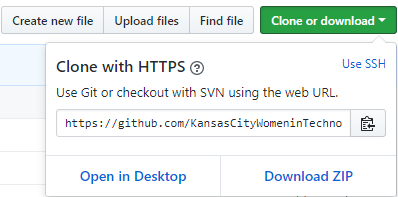
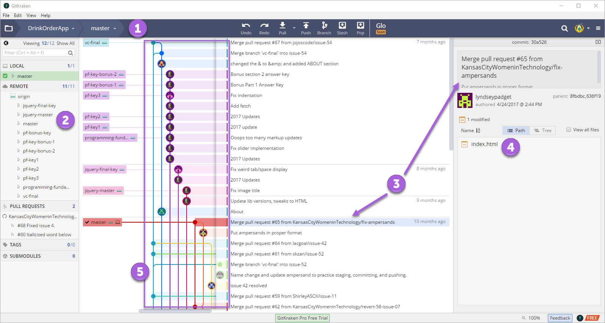
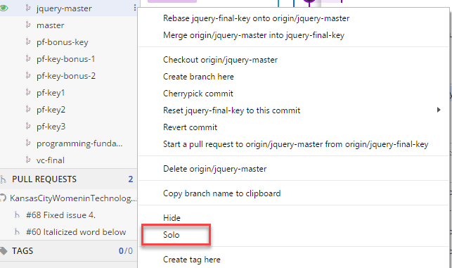

1. In Chrome, on the main overview page for "DrinkOrderApp" repository, click on the green **Clone or download** button and click the  button to copy the link to the repository.
   
   

1. Open GitKraken. Clone a repository in GitKraken by selecting **File** <i class="fa fa-long-arrow-right"></i> **Clone Repo**. 

1. In the **Repository Management** dialog that displays, select **Clone with URL**. Click on **Browse**. Navigate to and select the "CodingAndCocktails/session3" folder to populate the **Where to clone to** field.
  
   
   
Windows users - Navigate to your home directory by typing `%USERPROFILE%` in the file explorer navigation bar.
    

1. Paste the link to the repository in the **URL** field. GitKraken will display the a **Full path** field. Notice it automatically adds the name of the repository to the path. Click **Clone the repo!**. 

1. When the banner with the text "Successfully cloned repo 'DrinkOrderApp'" displays, click on **Open Now**.

1. When the repository opens, notice it looks almost like what we saw in GitHub with a lot of the same information. We see

   
     <i class="fa fa-circle fa-stack-2x help-annotations"></i>
     <strong class="fa-stack-1x help-annotations-text">1</strong>
   
   Repository name and selected branch

   
     <i class="fa fa-circle fa-stack-2x help-annotations"></i>
     <strong class="fa-stack-1x help-annotations-text">2</strong>
   
   A list of all branches in the repository

   
     <i class="fa fa-circle fa-stack-2x help-annotations"></i>
     <strong class="fa-stack-1x help-annotations-text">3</strong>
   
   A commit for a branch along with author, message, modified date, and unique identifier

   
     <i class="fa fa-circle fa-stack-2x help-annotations"></i>
     <strong class="fa-stack-1x help-annotations-text">4</strong>
   
   List of files modified

   
     <i class="fa fa-circle fa-stack-2x help-annotations"></i>
     <strong class="fa-stack-1x help-annotations-text">5</strong>
   
   The paths for all the branches as an unified view (aka a graph and "Git tree")

   
  
1. Take a look at the list branches available in the repository (circle #2). Click on a different branch in the list, such as the one named "jquery-master". Notice a different commit highlights and the commit information on the right (circle #3) changes. Feel free to click on different branches (you can't break anything).
   
Right click shows more options. We won't cover using them in GitKraken but you'll use some of the concepts later in the session.
   

1. Select a file from the list of files modified (circle #4). The main view changes to show the "diff view" like we saw in GitHub. Click on the "X" at the top of the main view above the checkbox for **Ignore white space** to return to the graph view. 

   

1. Double click on a branch, such as the one named "jquery-master". Notice your selected branch changed (circle #1). You may have also noticed a message appear and disappear. You switched branches and the **LOCAL** list of branches on the list now contains "jquery-master". We'll cover more about this a little later tonight. 

1. Now let's turn our attention towards the Git tree. This shows all the branches in an unified view and how each path converges and diverges. Each branch is a different color. Circles with pictures and solid circles represent different commits. 
   
It looks like a maze, but using this view we can trace revisions and see how a change affects the project as a whole. The ability to create branches in version control allows large groups of people can work independently and still collaborate on a single project.    
   

1. Right click on "jquery-master" in the left panel with the list of all the branches. Select **Solo** as shown in the picture below.

   

   The tree view zooms in and only displays the "jquery-master" branch. Select **Solo** again to revert to the tree view.
   
Targeting one branch in a view makes identifying changes easier. This is the same view we had in GitHub when we saw all the commits for the selected branch.
   

1. In your terminal, navigate to "CodingAndCocktails/session3" directory. You can check what folder you're in by typing `pwd` <i class="fa fa-share fa-rotate-180"></i>.

1. Type `ls` <i class="fa fa-share fa-rotate-180"></i>. Notice GitKraken created a folder with the same name as the repository you cloned, "DrinkOrderApp".

