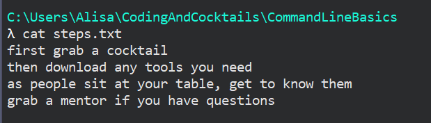

1. We'll practice using vim on the _CLIFun.txt_. Open your file in vim by typing `vim CLIFun.txt` <i class="fa fa-share fa-rotate-180"></i>.
    
While **vim** is one option for a text editor, there are others available. You can use this [vim cheat sheet](https://vim.rtorr.com/) to take full advantage of its powerful features.
    

   What's with all the squigglies?!?

   

   Don't worry! By learning a few basic vim commands, you'll be saving contents in your files in no time. Let's start by copying the [**lorem ipsum**](https://en.wikipedia.org/wiki/Lorem_ipsum) text below.

    ```
      Lorem ipsum dolor sit amet, consectetur adipiscing elit, sed do eiusmod tempor incididunt ut labore
      et dolore magna aliqua. Ut enim ad minim veniam, quis nostrud exercitation ullamco laboris nisi ut
      aliquip ex ea commodo consequat.
    ```
1. In your terminal, press `i` to enter **INSERT** mode.

7. Now use the keyboard combination **⌘V** on your Mac or **Shift + Ins** in Cmder to paste the text you copied.

1. Press `Esc` to exit out of **INSERT** mode.

1. Next, type in `:wq` <i class="fa fa-share fa-rotate-180"></i>. Now we've got some content to play with!
    
The 'w' stands for **w**rite and the 'q' stands for **q**uit.
    

1. Inspect the contents of _CLIFun.txt_ using `cat`.

1. To add more content, type `vim CLIFun.txt` <i class="fa fa-share fa-rotate-180"></i> to enter the editor again. Press `i` again like we did before and start entering in some text.

   But that messed up our lorem ipsum sample! What to do?!? No worries, let's close out of the text editor without saving our changes. We did a 'write' and then 'quit' earlier, let's instead skip the 'write' part.

1. Press `Esc` to exit out of **INSERT** mode.

1. Type `:q` <i class="fa fa-share fa-rotate-180"></i>.
      
You'll see '**E37: No write since last change \(add ! to override\)**'. Follow the instructions there by typing `:q!` <i class="fa fa-share fa-rotate-180"></i>.
      

1. Inspect the contents of _CLIFun.txt_ using `cat` to confirm your changes weren't saved.

1. Let's add some more content to our _steps.txt_ file. Open your file in vim by typing `vim steps.txt` <i class="fa fa-share fa-rotate-180"></i>.

1. We want to navigate to the end of file. Type `G` <i class="fa fa-share fa-rotate-180"></i>.
   
Casing matters! Be sure to type `G`.      
   
   
Vim is powerful, but can be overwhelming at first with all the shortcuts available. We could move to the end of the file by moving the cursor using arrow keys that we're familiar with or we can navigate to the last line of a file using `G`.
   

1. Press `o` to add a new line to the file then type `grab a mentor if you have questions`.

1. Hit `Esc` to exit out of **INSERT** mode and save the file using `:wq` <i class="fa fa-share fa-rotate-180"></i>. Inspect your file using `cat` or in the explorer. Your file should look like this


