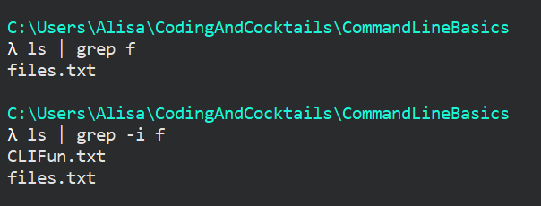

1. We can pipe output from one command to another and create powerful commands. Type `ls | grep txt` <i class="fa fa-share fa-rotate-180"></i> to view all _txt_ files in the current directory.
   
We are using the pipe operator (`|`) to take the output of `ls` and use it as input for `grep`.
   

   Since we only have _txt_ files this isn't too useful yet.

1. Type `ls | grep f` <i class="fa fa-share fa-rotate-180"></i>. Now we see 1 file _files.txt_ because it has a 'f' in the name.

1. Suppose we don't care about casing. Type `ls | grep -i f` <i class="fa fa-share fa-rotate-180"></i>. Now we see 2 files
   

   
The functionality of `|` seems similar to `>` or `>` but there is a distinction. Pipes (`|`) redirects data from one command to another command but redirection operators (`>` and `>>`) redirects the output of the command to file.
   