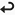

# Homework

---
#### More Practice

1. Work through the Command Line course on codecademy at [https://www.codecademy.com/learn/learn-the-command-line](https://www.codecademy.com/learn/learn-the-command-line).

2. Beat the game at [http://overthewire.org/wargames/bandit/](http://overthewire.org/wargames/bandit/). You'll start by entering in the command `ssh bandit0@bandit.labs.overthewire.org`  and typing `bandit0` as the password when prompted.
    
The `ssh` command stands for **s**ecure **sh**ell and is a network protocol, much like `telnet`.
    
    
The higher levels of this game can get decently advanced but just take it step by step. You can follow the walkthrough at [https://www.yalpski.net/bandit-wargame](https://www.yalpski.net/bandit-wargame) for levels 0-17 if you need further help. Always seach the internet for anything you don't understand or need further information on!
    

